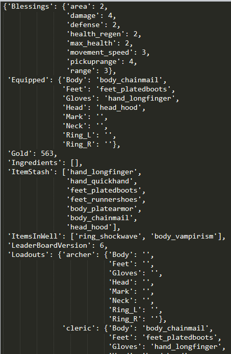

# HotProfileTool
Simple Python script to decrypt and encrypt the Hell of Torment profile.dat file,

**USAGE:** python HoTProfileXOR.py HoT_profile.dat

Disable cloud sync for save's else you wont have a HoT_Profile.dat.

**Save Location: **Steam\userdata\<USER-ID>\2218750\remote

## Note:
Made this quikcly so i could just give myself infinite money, and was interested to see what got saved.

Although their is XOR used to encrypt the save file and the XOR key is 4 bytes long to make it harder to guess in theory. 
due to its usage only the first byte is ever used. thus the encryption key is 4.

## Example deseralised HoT_Profile.dat

